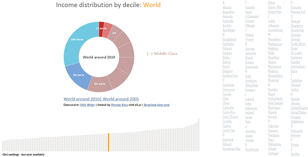

# <big>&#9733;Dataviz builder</big><big> with D3js:</big><big> Inequality dashboard &#9733;</big>

#### &#9733;<i>Thomas Roca, PhD - AFD Research Direction &#9733;</i>
*Version march the 15th 2016*

 
The following script aims at creating a dataviz dashboard representing inequality across space and time, to understand better inequality evolutions and disaprities among and within countries.

Two types of visualization will be used -  and interact with eachother. A *Bar chart* will display the [Gini coefficient](https://en.wikipedia.org/wiki/Gini_coefficient)  - that summarizes inequality in a single meseaure (the lower the Gini the lower the inequality). And a *donut chart* will display income/consumption distribution by decile, within countries.
We use the [d3.js library](https://d3js.org/) for both of them.

The data used to create the Inequality Dashboard comes from [UNU-Wider](https://www.wider.unu.edu/). It gathers information computed from household surveys (income and consumption) from countries all over the world in the [WIID – World Income Inequality Database](https://www.wider.unu.edu/project/wiid-%E2%80%93-world-income-inequality-database) - starting mid 20th century.

#### Improvement and to-do-list:
+ improving the dataset cleaning
+ decision tree ? Efficiency trade off programming exception vs. manual final cleaning.. :| no clue yet
+ A least explain the criterion for chosing a data vs another

**Link to resulting datavisualization dashboard**

